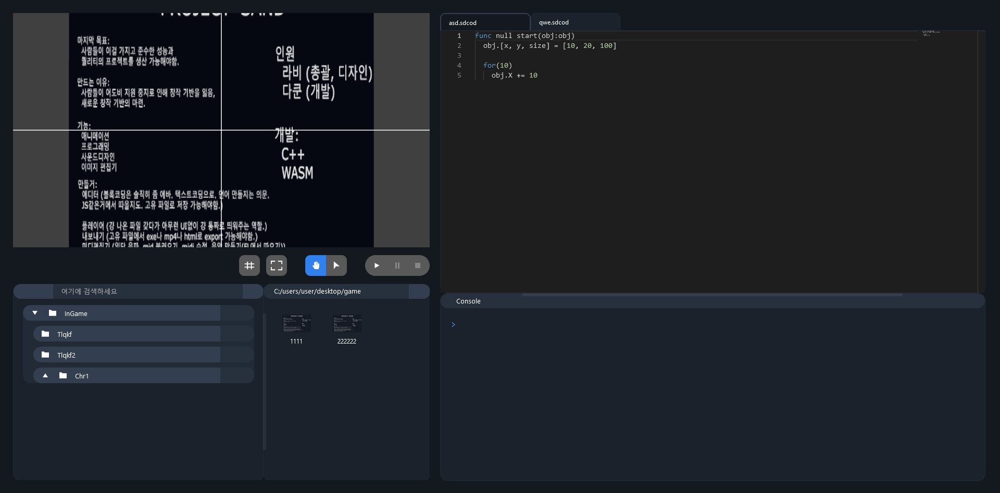

  
  <h3>SAND-Editer</h3>
  
  <a href="#introducion">introducion</a>
   - 
  <a href="#install">install</a>
   - 
  <a href="#Documentation">Documentation</a>
   - 
  <a href="#Authors">Authors</a>
   - 
  <a href="#License">License</a>

  

# Introducion

sdfasdfs

SAND-Editer (alias) is a programming language(or game engine) for coding beginners.

## Install

Windows
  - [SAND-Editer.zip (300MB)](https://a.com)
  - [Installer](https://a.com)

## Documentation

None.

## Authors

[@lavi](https://github.com/lavi27)

[@dacoon](https://github.com/dacoonkr)

## License

MIT
